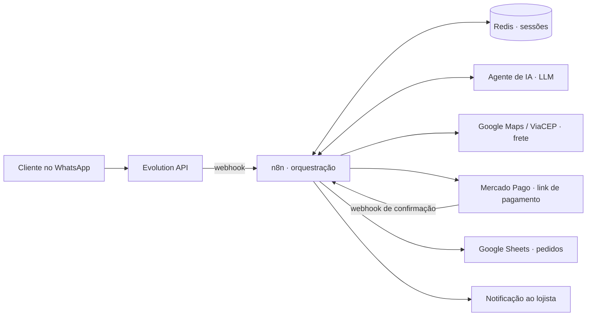

# Fluxo — Automação de atendimento no WhatsApp para o varejo local

> Sistema que atende clientes de pequenos varejistas no WhatsApp com um agente de IA: apresenta o catálogo, calcula frete pelo endereço, gera link de pagamento e registra o pedido — sem intervenção humana do lojista.

Status: em operação, com bot de referência ativo no varejo de materiais de construção (RJ). Projeto autoral: arquitetura, desenvolvimento, infraestrutura e operação comercial feitos por mim.

📱 Instagram do projeto: [@fluxo_atendimento](https://www.instagram.com/fluxo_atendimento/)

---

## O problema

Pequenos varejistas perdem venda porque não conseguem responder o WhatsApp em tempo real — o dono está no balcão, no estoque ou na entrega. Contratar atendente não cabe no caixa. A Fluxo coloca um agente de IA na frente desse atendimento, do "oi" ao pedido fechado.

## Como funciona (jornada do pedido)

1. Cliente chama no WhatsApp da loja → a mensagem chega via Evolution API (webhook)

2. O n8n orquestra o fluxo e mantém o contexto da conversa em Redis (sessão por cliente)

3. Um agente de IA (LLM) conduz o atendimento: entende o pedido, consulta o catálogo e responde com naturalidade

4. Para entrega, o endereço é resolvido e o frete é calculado com Google Maps / ViaCEP

5. O sistema gera um link de pagamento do Mercado Pago; a confirmação chega por webhook

6. Pedido confirmado é registrado em Google Sheets e o lojista é notificado — pronto para separar e entregar

## Arquitetura

Tudo roda self-hosted em VPS (Easypanel), o que mantém o custo por loja baixo e me dá controle total do ambiente.

## Stack

| Camada | Tecnologia |

|---|---|

| Canal | WhatsApp via Evolution API |

| Orquestração | n8n (workflows + código JavaScript nos nós) |

| Inteligência | Agente de IA (LLM) com instruções por vertical de varejo |

| Estado/Sessões | Redis |

| Pagamentos | Mercado Pago (links de pagamento + webhooks) |

| Frete | Google Maps / ViaCEP |

| Registro | Google Sheets |

| Infra | VPS própria com Easypanel |

## Decisões técnicas que valem menção

- Redis para sessão de conversa: WhatsApp é assíncrono e o cliente responde quando quer; guardar o contexto fora do fluxo permite retomar a conversa de onde parou sem estado preso no n8n.

- Self-hosted em vez de SaaS de chatbot: custo fixo baixo por loja e liberdade para customizar por vertical (cada tipo de varejo tem catálogo e jornada diferentes).

- Confirmação de pagamento por webhook, não por promessa do cliente: o pedido só vira pedido quando o Mercado Pago confirma — elimina o "já fiz o pix" falso.

## Por que o código não está público

Os workflows contêm lógica de negócio e integrações de clientes reais. Demonstração ao vivo do bot de referência disponível sob solicitação — me chame no [LinkedIn](https://www.linkedin.com/in/leonardo-da-silva-208101211/).

## Roadmap

- [ ] Novas verticais de varejo (catálogo e jornada por segmento)

- [ ] Painel do lojista (hoje o registro é via Google Sheets)

- [ ] Publicar aqui um workflow de exemplo sanitizado (sem credenciais e sem dados de cliente)
